# Buta.Lyfh, guide illustré et notice d'utilisation

Ce document s'adresse à quelqu'un qui découvre Buta.Lyfh sans rien en connaître : ni le projet, ni le métier, ni l'outil. Il explique le contexte, la finalité, ce que chaque écran et chaque visuel montrent, comment les lire, d'où viennent les chiffres, et se termine par une notice d'utilisation. Les captures datent du 18 septembre 2026 au soir (journée publiée du 17 septembre) ; les chiffres bougent chaque matin, la lecture ne change pas.

Adresse : https://buta.lyfh.fr, sur ordinateur ou téléphone, sans compte.

Sommaire : 1. Le contexte · 2. Le vocabulaire · 3. D'où viennent les données · 4. Lire l'interface · 5. Les écrans, visuel par visuel · 6. Les sept histoires · 7. Notice d'utilisation · 8. Questions fréquentes · 9. Annexes.

---

## 1. Le contexte

### 1.1 Pourquoi cet outil existe

Buta.Lyfh est un démonstrateur personnel construit par Frédéric Poissonnier à l'appui d'une candidature au poste de Responsable Performance chez Butagaz Eco-énergie (entretien téléphonique le mardi 22 septembre 2026). Il n'est affilié ni à Butagaz ni à Butagaz Eco-énergie : aucun logo, aucune couleur de marque, aucun chiffre présenté comme celui de l'entreprise.

Le poste consiste à piloter la performance d'un réseau d'installateurs (photovoltaïque, pompes à chaleur, chauffe-eau thermodynamiques, poêles, bornes de recharge) : construire et fiabiliser le pilotage du lead à l'encaissement, analyser les écarts, prévoir l'atterrissage de l'année, transformer l'analyse en plans d'action, tenir des rituels de revue, faire évoluer les outils et les référentiels. Plutôt que de décrire ce qu'il ferait, le candidat a construit l'outil avec lequel il le ferait.

### 1.2 Ce que c'est, ce que ce n'est pas

- C'est un cockpit de pilotage d'un réseau d'installateurs simulé, du premier contact client (le « lead ») jusqu'à l'argent encaissé, posé sur le marché réel des dix départements dans lesquels l'entreprise annonce publiquement être présente.
- Ce n'est ni un outil Butagaz, ni une base de données Butagaz, ni une recommandation d'implantation. Les données de marché sont réelles et publiques ; les données d'activité (leads, ventes, poses, encaissements) sont entièrement simulées, et chaque écran qui en montre porte le badge « simulé ».
- Aucune agence, personne ou entité réelle n'est associée à une performance simulée. Les neuf agences portent des noms de bassins géographiques (Saintonge, Angoumois, Marensin, Born, Marsan, Bordeaux Métropole, Haute Gironde, Bassin d'Arcachon, Nord), les commerciaux et techniciens sont des codes.

### 1.3 Le métier en une image : le parcours d'un dossier

Chaque dossier client suit six étapes, et tout l'outil est construit autour d'elles :

1. **Lead** : un contact entre dans le réseau par un canal (site web, leads achetés à une plateforme, prospection terrain, appels entrants, partenaires artisans ou courtiers, parrainage, base clients, salons).
2. **RDV tenu** : un commercial rencontre le client.
3. **Devis** : une offre chiffrée est remise.
4. **Signature** : le devis est signé ; c'est la vente. Elle peut être **annulée** dans les semaines qui suivent (rétractation, refus de financement).
5. **Pose** : les techniciens installent ; le délai entre signature et pose dépend de la charge des équipes et de la distance.
6. **Encaissement** : le client paie ; une partie peut arriver plus tard sous forme d'aides publiques versées à l'installateur.

À chaque étape correspondent des indicateurs (un taux de passage, un délai, un montant) et un écran qui permet de décider quelque chose.

---

## 2. Le vocabulaire

| Terme | Ce que ça veut dire ici |
|---|---|
| Cohorte | Tous les leads créés un même mois. Les taux de conversion se mesurent toujours sur une cohorte : « des leads de mai, combien ont signé ». |
| Cohorte mûre, cohorte en cours | Une cohorte est mûre 90 jours après son mois de création : elle a eu le temps de convertir. Avant, ses taux sont provisoires et l'écran le dit (« cohorte en cours »). |
| Mesure d'événement | Rattachée au mois où l'événement a lieu : la vente au mois de signature, la pose au mois de pose, l'encaissement au mois d'encaissement. Sert au chiffre d'affaires, à la marge, à la trésorerie. |
| Journée publiée | La dernière journée d'activité intégrée dans l'outil (le 17 septembre sur les captures). Tout ce qui est postérieur est invisible, comme dans un vrai système où la journée d'hier arrive le matin. |
| Prorata | Le mois en cours n'est pas fini : 17 jours publiés sur 30 en septembre. L'objectif et le N-1 sont multipliés par 17/30 avant comparaison, sinon tout serait « en retard de 43 % ». L'écran l'écrit chaque fois. |
| Objectif | Le chiffre d'affaires attendu, fixé par agence, produit et mois ; dans la simulation, il vaut le réalisé de 2025 plus 15 %. |
| N-1 | Le même mois de l'année précédente. Il n'existe pas pour 2025 (pas d'historique 2024) et l'écran le dit alors « n. d. ». |
| CA signé HT | Somme des devis signés, hors taxes et net de remise, au mois de signature. C'est la base de l'objectif et de l'atterrissage. |
| CA posé, encaissé | Les mêmes montants, comptés au mois de pose puis au mois d'encaissement. |
| Marge brute | CA signé moins le coût du matériel moins le coût de pose (la main d'œuvre technique). |
| Marge après acquisition | Marge brute moins les coûts d'acquisition des leads moins les commissions commerciales. |
| Résultat d'agence | Marge après acquisition moins les charges fixes de l'agence (salaires commerciaux, structure, véhicules). |
| Panier moyen | CA signé divisé par le nombre de ventes. |
| Remise moyenne | Remises accordées rapportées aux prix catalogue, pondérées par les prix. |
| Taux d'annulation à 60 jours | Part des signatures d'un mois annulées dans les 60 jours. N'est affiché que quand les 60 jours sont écoulés. |
| Coût par lead, coût par vente | Coût d'un canal d'acquisition divisé par ses leads, puis par les ventes issues de ces leads (hors commissions). |
| Pipe pondéré | Les devis en cours de moins de 90 jours, multipliés par la probabilité qu'ils signent (observée par âge du devis) et par la probabilité qu'ils ne soient pas annulés. |
| Run-rate | Le rythme des trois derniers mois, projeté sur les mois restants avec la saisonnalité du réseau. |
| Atterrissage | Le CA signé attendu en fin d'année : réalisé à date, plus pipe pondéré, plus run-rate au-delà des 45 jours couverts par le pipe, avec un intervalle et une probabilité d'atteindre l'objectif. |
| Carnet de pose | Le travail signé mais pas encore posé, exprimé en jours ouvrés de capacité technique. |
| n. d. | « Non disponible » : la valeur ne peut pas être calculée honnêtement (pas d'historique, cohorte trop jeune, division par zéro). L'outil n'affiche jamais un zéro trompeur à la place. |

---

## 3. D'où viennent les données

### 3.1 Le marché : réel et sourcé

Cinq sources publiques, chacune avec sa licence et sa date de référence, affichées en bas de chaque écran qui les utilise.

| Source | Ce qu'on en retient | Référence |
|---|---|---|
| Insee, Logement 2022 (à la commune) | résidences principales, maisons, propriétaires occupants, chauffage au fioul, au gaz en citerne, au gaz de ville, à l'électricité | millésime 2022, vérifié le 17 septembre 2026 |
| ADEME, liste des entreprises RGE | installateurs qualifiés pompe à chaleur, photovoltaïque, chauffe-eau thermodynamique, comptés par commune et département | vérifié le 17 septembre 2026, rejeu mensuel |
| RTE (ODRÉ), registre des installations | installations solaires raccordées et leur puissance, par commune | au 31 juillet 2026 |
| ADEME, DPE logements existants | maisons en étiquette F ou G, énergie de chauffage (fioul, GPL, propane, butane) | vérifié le 17 septembre 2026, rejeu mensuel |
| Etalab, contours administratifs | contours des départements et des communes, simplifiés pour la carte | annuel |

Des chiffres de contrôle sont revérifiés à chaque chargement (tolérance 0,5 %) : par exemple 32,7 millions de résidences principales en France, 2,6 millions au fioul, 23 500 installations solaires en Charente-Maritime.

### 3.2 L'activité : simulée, avec des hypothèses écrites

- Un générateur déterministe (même graine, même résultat) produit 72 261 dossiers du 1er janvier 2025 au 31 décembre 2026. Seule la part jusqu'à la veille est « publiée » : l'outil vit comme un vrai système, la journée d'hier arrive le matin.
- Le volume de leads découle du marché réel (propriétaires occupants de chaque bassin, plafonné par l'effectif commercial) : environ 3 000 leads par mois, 3 100 ventes et 2 800 poses par an, 27 M€ de CA signé annuel.
- Neuf agences, huit canaux d'acquisition, huit produits avec prix catalogue, taux de pose, marge cible et saisonnalité propres, 44 commerciaux et 52 techniciens désignés par des codes.
- Funnel de base par cohorte : 45 % de RDV tenus, 70 % de devis, 32 % de signature, 8 % d'annulations, modulés par canal, par agence et par commercial. Délais tirés au sort autour de médianes réalistes (6 jours du lead au RDV, 12 du devis à la signature, 45 de la signature à la pose sur place, 75 à distance, 20 de la pose à l'encaissement).
- Coûts d'acquisition par canal, commissions de 4 % du CA, charges d'agence par effectif, aides publiques en mandat financier : des ordres de grandeur documentés, jamais présentés comme réels.
- Objectifs 2026 : réalisé 2025 plus 15 %. Le réseau ne les atteint pas ; c'est le scénario voulu, celui où un Responsable Performance sert à quelque chose.

### 3.3 Comment les chiffres circulent

1. Les dossiers simulés et les données de marché sont stockés dans une base Postgres (Supabase).
2. Vingt et une **vues de calcul** (préfixées `mart_`) calculent tous les indicateurs en SQL : chaque vue et chaque colonne est commentée. **Aucun chiffre n'est calculé dans l'interface** ; ce qui doit réagir à un réglage à l'écran (un curseur, un poids) passe par une petite bibliothèque testée.
3. Chaque matin, des automatisations publient la journée de la veille, rafraîchissent les vues, exécutent douze contrôles de cohérence et envoient un email si quelque chose cloche.
4. L'application web lit les vues. Si la base ne répond pas, elle bascule sur un **instantané** statique embarqué avec le site, et le badge le dit.
5. Un modèle de langage peut rédiger des explications, mais seulement à partir de faits calculés en SQL qui lui sont transmis ; un contrôle refuse toute phrase contenant un nombre absent des faits. Sans clé de modèle, tout est rédigé par règles et l'écran le dit.

---

## 4. Lire l'interface : les éléments communs

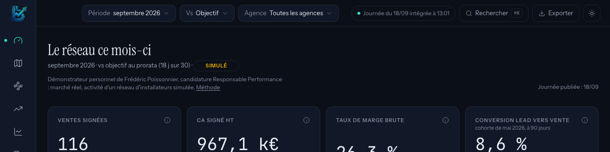

*La barre haute et le rail sont les mêmes sur tous les écrans.*

### 4.1 La barre haute

De gauche à droite :

- **Période** : un mois, un trimestre ou une année à date. Par défaut, le mois de la journée publiée.
- **Vs** : la comparaison, objectif ou N-1. Elle s'applique à tous les écarts affichés.
- **Agence** : toutes les agences (le réseau) ou une seule. Le titre de chaque écran se met au nom de l'agence choisie.
- **Journée du 17/09 intégrée à 11:25** : le badge de fraîcheur. Il dit quelle journée simulée est publiée et à quelle heure elle a été intégrée. Il se relit tout seul quand on revient sur l'onglet.
- **Rechercher (Cmd K ou Ctrl K)** : la palette de commandes.
- **Exporter** : exporte le tableau principal de l'écran (CSV ou tableur).
- Le bouton rond à droite bascule entre le thème sombre et le thème clair.

Ces réglages vivent dans l'adresse de la page : un lien copié montre exactement la même vue à quelqu'un d'autre (`?periode=2026-05&comparaison=n1&agence=SAI`).

### 4.2 Le rail et le tiroir

Le rail à gauche liste les onze écrans (le libellé apparaît au survol) : Vue d'ensemble, Territoires, Funnel et leads, Ventes et marge, Forecast et atterrissage, Pose et encaissement, Plans d'action et rituels, Qualité et référentiels, Automatisations, Analyste, Méthode. Le monogramme en haut ramène à l'accueil. Sur téléphone, le rail devient un tiroir ouvert par le bouton en haut à gauche.

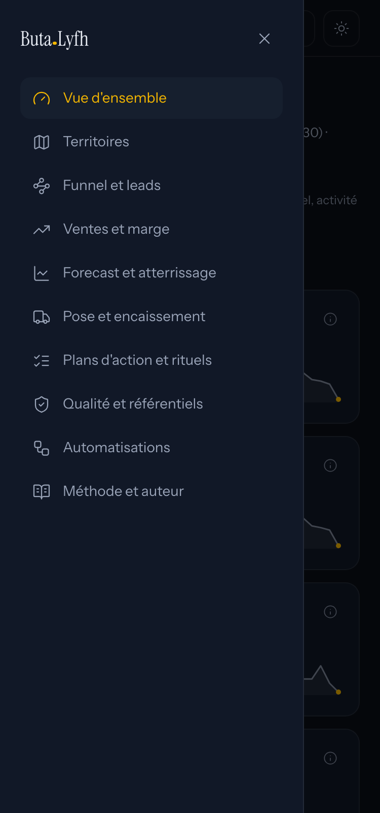

### 4.3 Les badges

Trois badges disent la nature de ce qu'on regarde : **simulé** (ambre) pour les données d'activité, **réel, source** (vert) pour le marché, **instantané** (gris) quand l'application affiche l'instantané de secours parce que la base n'a pas répondu.

### 4.4 Une carte KPI, élément par élément

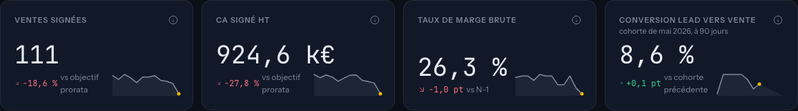

Chaque compteur se lit ainsi :

- le **libellé** en capitales (« CA signé HT ») et parfois un sous-libellé qui précise la mesure (« cohorte de mai 2026, à 90 jours ») ;
- la **valeur**, en chiffres à espacement fixe pour que les colonnes s'alignent ;
- la **variation** avec sa flèche et sa couleur (vert : favorable, rouge : défavorable ; pour un indicateur où « plus bas = mieux », les couleurs s'inversent) et sa base (« vs objectif prorata », « vs N-1 ») ;
- la **mini courbe** des douze derniers mois, le point ambre marquant la dernière valeur ;
- le bouton **i** qui ouvre la fiche de l'indicateur.

### 4.5 La fiche d'un indicateur

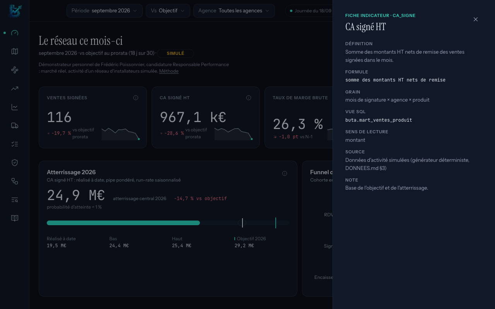

Chaque indicateur a une fiche : définition, formule, grain (la maille de calcul), vue SQL d'origine, sens de lecture, source, note. C'est la garantie qu'on parle tous de la même chose : un chiffre sans définition ne se discute pas.

### 4.6 Les tableaux

- Clic sur un en-tête : tri par colonne ; la flèche indique le sens.
- **Exporter** en bas à droite : le tableau en CSV ou en tableur, avec les mêmes colonnes.
- Sur téléphone, les colonnes secondaires se masquent et une mention indique de faire défiler horizontalement.

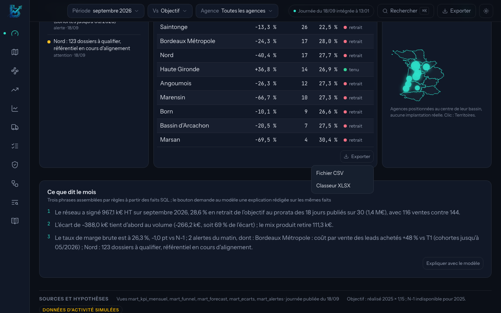

### 4.7 Les graphiques

Le menu « ⋯ » de chaque graphique propose : plein écran, image PNG, export CSV des données tracées, et la requête SQL qui les produit. Le bouton « i » ouvre la fiche de l'indicateur principal. Chaque graphique porte son unité et, quand un axe est tronqué, le sous-titre le dit.

### 4.8 La palette de commandes

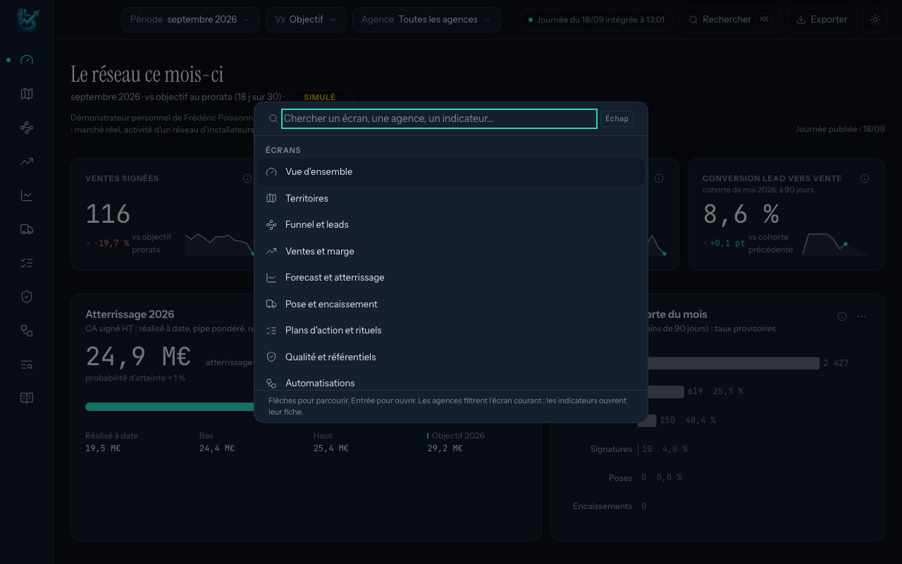

Cmd K (Ctrl K sur Windows) ouvre une recherche : un écran (on y va), une agence (elle filtre l'écran courant), un indicateur (sa fiche s'ouvre). La recherche ignore les accents et tout se fait au clavier.

### 4.9 La ligne « Sources et hypothèses »

En bas de chaque écran : les vues SQL lues, les sources réelles avec leur licence et leur date, les hypothèses de calcul, et le badge « données d'activité simulées ». C'est là qu'on vérifie d'où sort ce qu'on vient de lire.

### 4.10 Thème clair

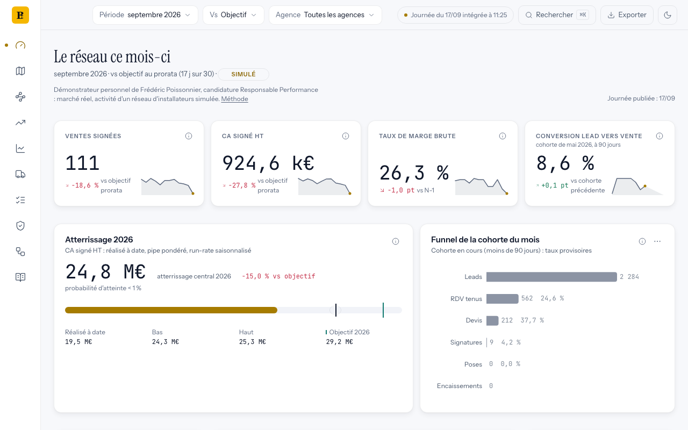

Le thème clair reprend les mêmes tokens ; les graphiques suivent.

---

## 5. Les écrans, visuel par visuel

Chaque écran répond à une question, écrite dans son titre. Pour chaque visuel : ce qu'il montre, comment le lire, ce qu'on en fait.

### 5.1 Vue d'ensemble : « Le réseau ce mois-ci »

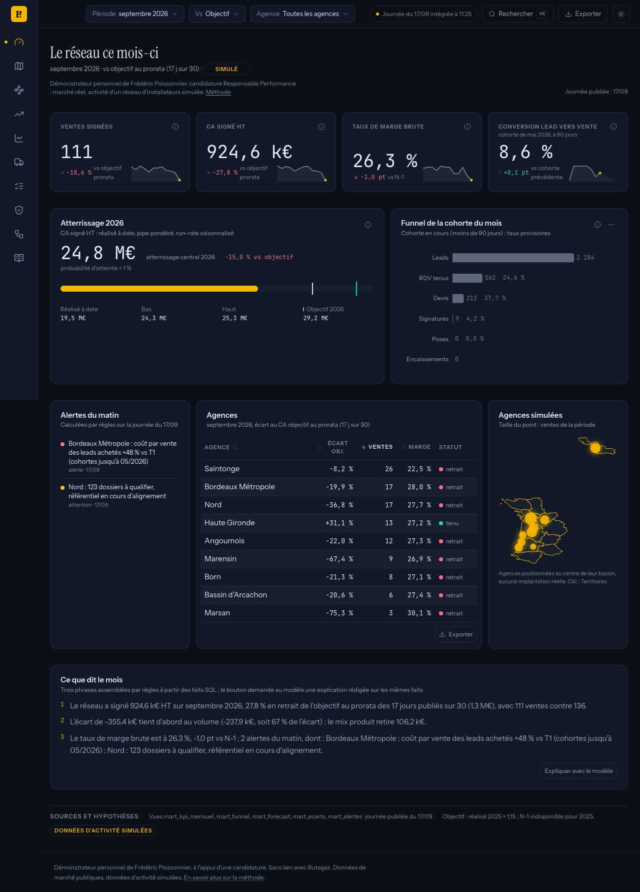

La question : où en est le réseau ce mois-ci, où sont les écarts, que faire ce matin.

**Les quatre compteurs** (ventes signées, CA signé HT, taux de marge brute, conversion lead vers vente).
- Ce que ça montre : le mois en cours contre l'objectif au prorata des jours publiés (17 jours sur 30), la marge contre N-1, et la conversion de la dernière cohorte mûre (celle de mai 2026, à 90 jours).
- Comment le lire : 111 ventes signées, 18,6 % sous l'objectif proratisé ; 924,6 k€ de CA, 27,8 % sous l'objectif ; marge brute à 26,3 %, un point sous N-1 ; 8,6 % des leads de mai sont devenus une vente.
- Ce qu'on en fait : c'est l'ordre du jour du point du matin. Un écart s'explique sur Ventes et marge, une conversion sur Funnel.

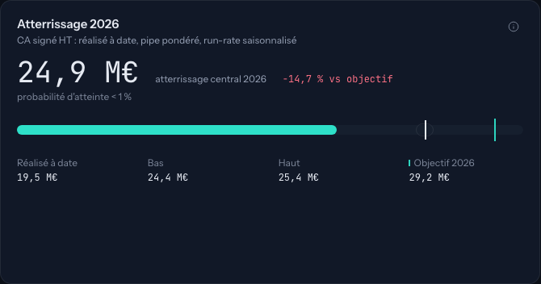

**Atterrissage 2026.**
- Ce que ça montre : le CA signé attendu en fin d'année (24,8 M€), l'objectif (29,2 M€), l'écart (-15 %), la probabilité d'atteindre l'objectif (moins de 1 %), et une jauge : réalisé à date (19,5 M€), bornes basse et haute (24,3 à 25,3 M€), objectif.
- Comment le lire : la partie pleine de la jauge est le réalisé ; le trait clair est la fourchette d'atterrissage ; le trait vert est l'objectif. Si l'objectif est à droite de la fourchette, il ne sera pas atteint sans changer quelque chose.
- Ce qu'on en fait : le montant à trouver et le délai qui reste ; le détail des hypothèses est sur l'écran Forecast.

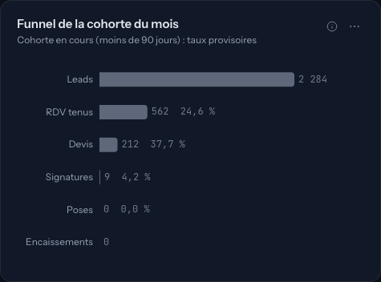

**Funnel de la cohorte du mois.**
- Ce que ça montre : les leads créés ce mois-ci (2 284) et, pour chacune des étapes suivantes, combien y sont arrivés à ce jour, avec le taux de passage depuis l'étape précédente.
- Comment le lire : en gris tant que la cohorte a moins de 90 jours (« taux provisoires ») ; un lead de septembre n'a pas fini de convertir, ses 9 signatures ne disent rien encore. La barre en ambre apparaît quand la cohorte est mûre.
- Ce qu'on en fait : rien de définitif avant 90 jours ; c'est justement la leçon.

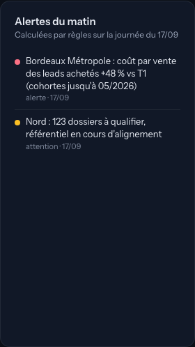

**Alertes du matin.**
- Ce que ça montre : des alertes calculées par règles à la journée publiée, datées, avec leur valeur : coût par vente des leads achetés de Bordeaux Métropole à +48 % vs le premier trimestre ; 123 dossiers à qualifier dans le Nord, référentiel en cours d'alignement.
- Comment le lire : une alerte rouge demande une décision, une alerte ambre une vérification. Le texte est assemblé en SQL à partir de la valeur, pas rédigé à la main.
- Ce qu'on en fait : chacune renvoie à un plan d'action (écran Plans d'action) ou à Qualité.

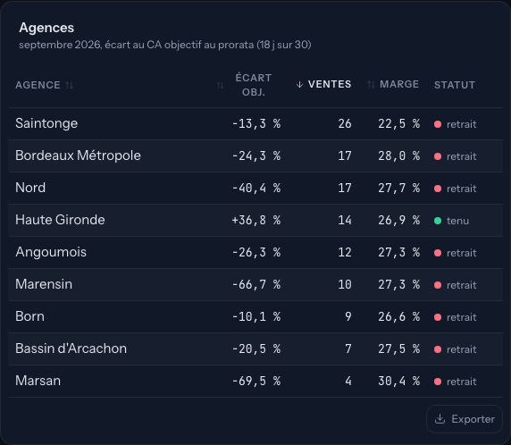

**Agences.**
- Ce que ça montre : par agence, l'écart à l'objectif du CA, les ventes, le taux de marge, le résultat, le délai de pose, et un statut (tenu, attention, retrait).
- Comment le lire : trié par ventes ; la pastille dit le statut avec un mot, jamais la couleur seule. Un clic ouvre l'écran Ventes filtré sur l'agence.
- Ce qu'on en fait : repérer en une ligne qui décroche et de combien.

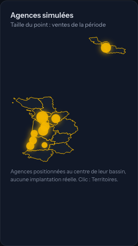

**Agences simulées.**
- Ce que ça montre : les onze départements du périmètre et les neuf agences, chacune au centre de son bassin, colorées par leur écart à l'objectif.
- Comment le lire : le Sud-Ouest et le Nord ; les départements sans agence sont couverts à distance par l'agence la plus proche.

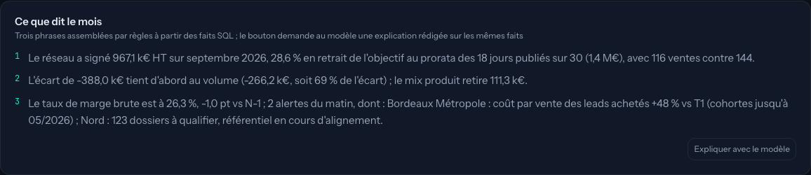

**Ce que dit le mois.**
- Ce que ça montre : trois phrases assemblées par règles à partir des faits SQL : le CA et son écart, la décomposition de l'écart, la marge et les alertes.
- Comment le lire : chaque nombre de ces phrases existe dans une vue SQL. Le bouton « Expliquer avec le modèle » demande la même explication rédigée par un modèle de langage, sur les mêmes faits ; si le modèle n'est pas configuré, les phrases par règles restent et l'écran le dit.
- Ce qu'on en fait : le texte du point du matin, prêt à copier.

### 5.2 Ventes et marge : « D'où vient l'écart de chiffre d'affaires »

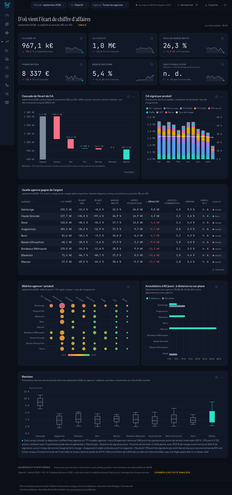

La question : pourquoi le CA n'est pas là où il devrait être, et qui gagne de l'argent.

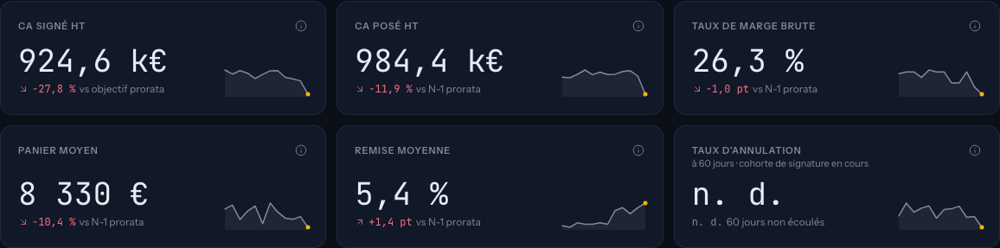

**Les six compteurs** : CA signé HT, CA posé HT, taux de marge brute, panier moyen, remise moyenne, taux d'annulation à 60 jours.
- Comment le lire : le taux d'annulation affiche « n. d. » pour le mois en cours parce que les signatures n'ont pas encore 60 jours ; sur un mois clos, il s'affiche et se compare à N-1.

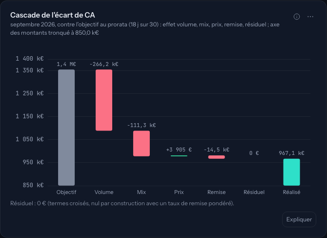

**Cascade de l'écart de CA.**
- Ce que ça montre : on part de l'objectif (au prorata), on ajoute ou retire quatre effets et on arrive au réalisé : l'effet **volume** (moins de ventes), l'effet **mix** (des produits moins chers dans le panier), l'effet **prix** (des prix catalogue différents), l'effet **remise** (plus ou moins de remise accordée). Le résiduel est nul par construction.
- Comment le lire : les barres rouges retirent, les vertes ajoutent ; les deux barres grises sont les points de départ et d'arrivée. L'axe est tronqué pour que les effets se voient, et le sous-titre le dit.
- Ce qu'on en fait : en septembre, l'écart de -355 k€ tient d'abord au volume (-238 k€, 67 % de l'écart) puis au mix (-106 k€) : ce n'est pas un problème de prix, c'est un problème de nombre de ventes. Le bouton « Expliquer » écrit le constat, les causes classées et une action.

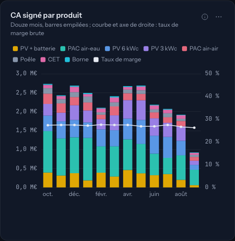

**CA signé par produit.**
- Ce que ça montre : douze mois de CA en barres empilées par produit, et le taux de marge brute en courbe sur l'axe de droite.
- Comment le lire : la saisonnalité se voit (photovoltaïque au printemps, chauffage à l'automne, août creux) ; la courbe de marge dit si le mix qui se vend est le mix qui rapporte.

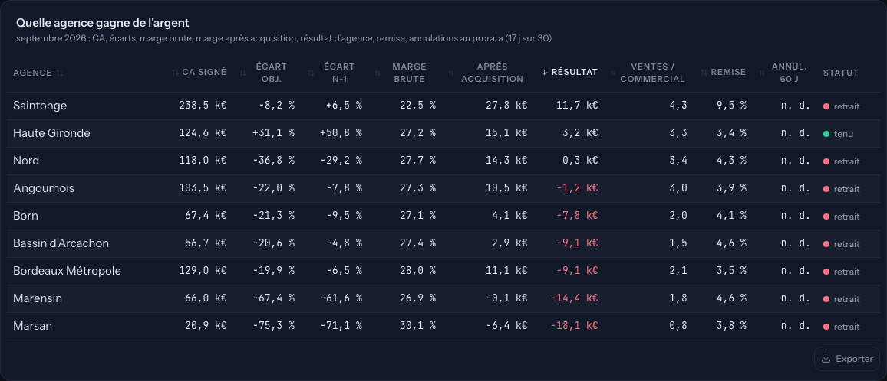

**Quelle agence gagne de l'argent.**
- Ce que ça montre : par agence, le CA, l'écart à l'objectif et à N-1, la marge brute, la marge après acquisition, le résultat, les ventes par commercial, la remise, les annulations.
- Comment le lire : la marge brute dit si l'agence vend bien ; la marge après acquisition dit si elle vend à un coût raisonnable ; le résultat dit si elle couvre ses charges. Sur un mois plein le réseau gagne de 12 à 200 k€ avec une à cinq agences en perte ; en cours de mois, le résultat est souvent négatif parce que les coûts d'acquisition sont engagés à la création du lead et la marge n'arrive qu'à la signature, plusieurs semaines après.
- Ce qu'on en fait : c'est le tableau de la revue de marge mensuelle.

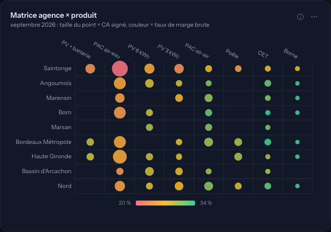

**Matrice agence × produit.**
- Ce que ça montre : une bulle par couple agence et produit ; la taille est le CA, la couleur le taux de marge.
- Comment le lire : une grosse bulle sombre est un produit qui pèse mais rapporte peu ; une petite bulle claire, un produit rentable qu'on vend peu.

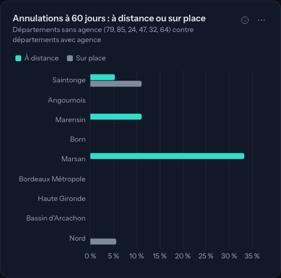

**Annulations à 60 jours, à distance ou sur place.**
- Ce que ça montre : par agence, le taux d'annulation des ventes réalisées dans les départements couverts à distance contre celles réalisées sur place.
- Comment le lire : la distance se paie en annulations (14 % contre 8 % dans la simulation), après s'être payée en délai de pose (écran Pose).

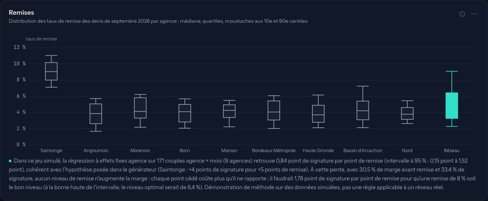

**Remises.**
- Ce que ça montre : la distribution des remises par agence en boîtes à moustaches (médiane, quartiles, extrêmes), et une phrase qui mesure ce que la remise rapporte.
- Comment le lire : la phrase vient d'une régression à effets fixes agence sur les mois clos : chaque point de remise gagne 0,84 point de taux de signature (intervalle à 95 % : 0,15 à 1,52). À cette pente, aucune remise n'augmente la marge ; il faudrait 1,78 point de signature par point de remise pour qu'une remise de 8 % soit le bon niveau.
- Ce qu'on en fait : une démonstration de méthode sur données simulées ; sur des données réelles, la même méthode dirait où plafonner la remise.

### 5.3 Funnel et leads : « Où se perd la conversion »

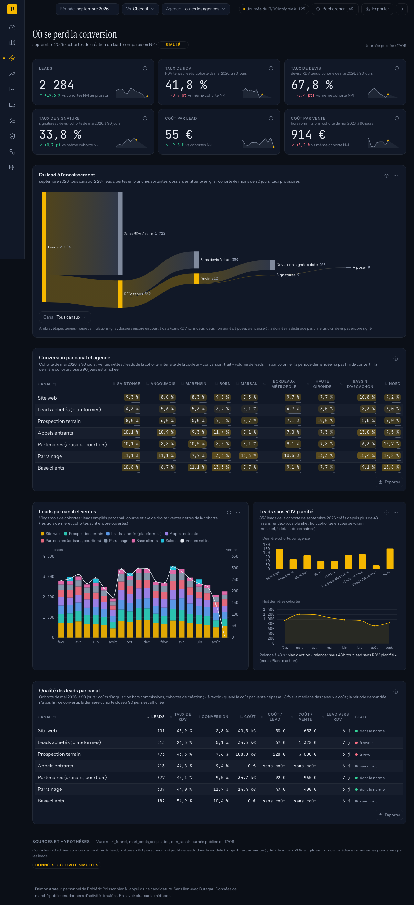

La question : à quelle étape on perd, quel canal vaut son coût, quels leads attendent.

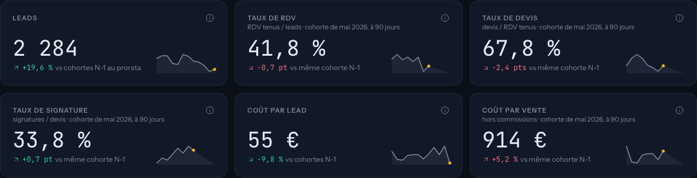

**Les six compteurs** : leads, taux de RDV, taux de devis, taux de signature, coût par lead, coût par vente.
- Comment le lire : les leads du mois se comparent aux cohortes N-1 au prorata ; les taux et le coût par vente sont mesurés sur la dernière cohorte mûre (mai 2026, à 90 jours : 41,8 % de RDV, 67,8 % de devis, 33,8 % de signature, 914 € par vente), parce qu'une cohorte de septembre n'a pas fini de convertir.

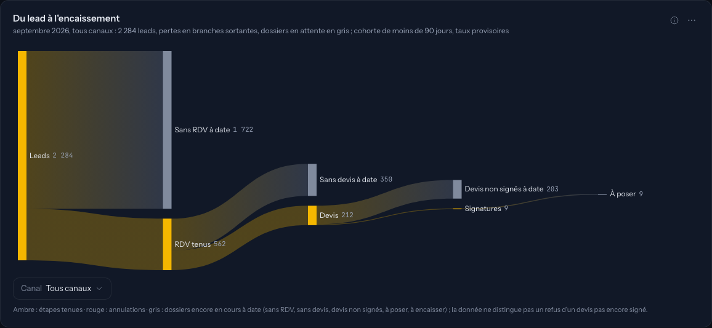

**Du lead à l'encaissement (diagramme de flux).**
- Ce que ça montre : les leads de la période coulent de gauche à droite : RDV tenus, devis, signatures, poses, encaissements. Les branches qui sortent sont les dossiers qui n'ont pas franchi l'étape.
- Comment le lire : ambre, les étapes tenues ; rouge, les pertes ; gris, ce qui est encore en cours. Sur une cohorte de moins de 90 jours, les branches « sans RDV à date », « sans devis à date », « devis non signés à date » sont grises : un devis pas encore signé n'est pas un refus. Le sélecteur de canal filtre le flux ; changer d'agence le redessine.
- Ce qu'on en fait : voir l'étape qui fuit le plus, et pour quel canal.

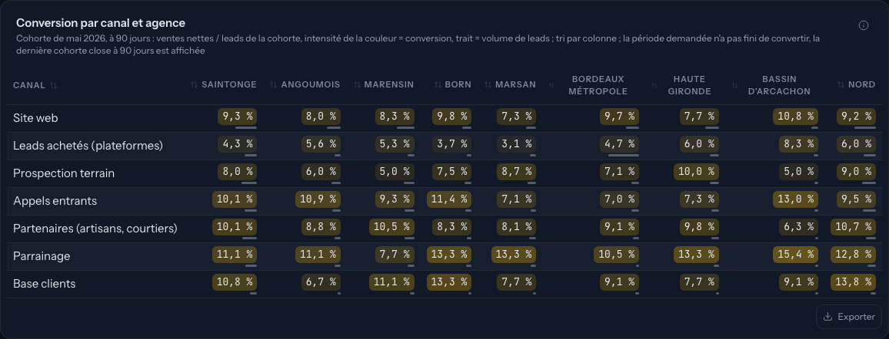

**Conversion par canal et agence.**
- Ce que ça montre : le taux de conversion (ventes nettes / leads) de chaque canal dans chaque agence, sur la dernière cohorte close à 90 jours ; l'intensité de la couleur est la conversion, le petit trait le volume de leads.
- Comment le lire : un canal sombre partout convertit mal partout (problème de canal) ; un canal sombre dans une seule agence pointe l'agence. Tri par colonne en cliquant.

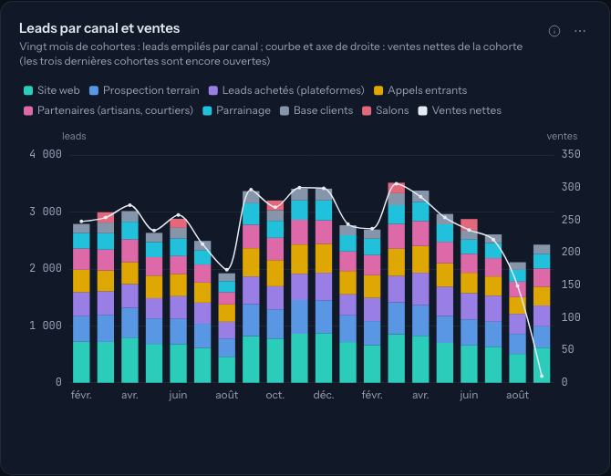

**Leads par canal et ventes.**
- Ce que ça montre : vingt mois de leads empilés par canal, et les ventes nettes de chaque cohorte en courbe (axe de droite).
- Comment le lire : quand une couleur grossit sans que la courbe suive, le canal apporte du volume, pas des ventes (c'est l'histoire des leads achetés de Bordeaux Métropole).

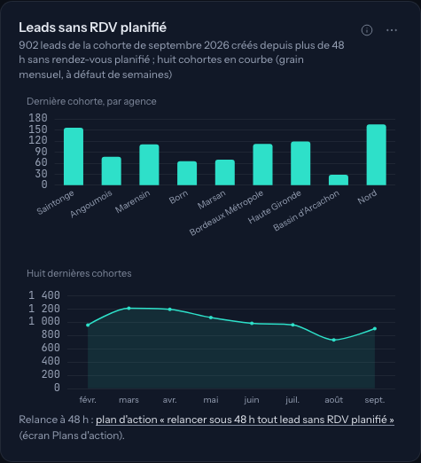

**Leads sans RDV planifié.**
- Ce que ça montre : les leads créés depuis plus de 48 heures sans rendez-vous planifié, par agence, et sur les huit dernières cohortes.
- Ce qu'on en fait : la file d'attente à relancer sous 48 h ; un plan d'action y est rattaché.

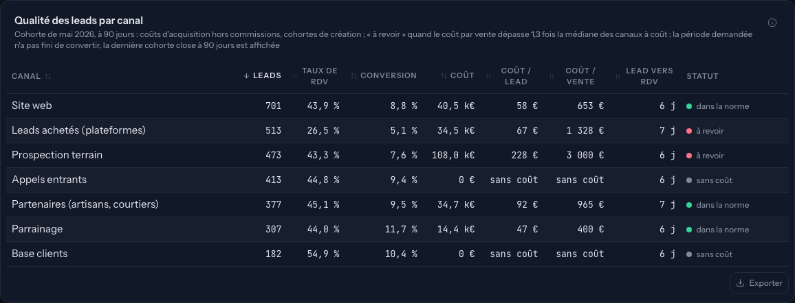

**Qualité des leads par canal.**
- Ce que ça montre : par canal, les leads, le taux de RDV, la conversion, le coût, le coût par lead, le coût par vente, le délai lead vers RDV, et un verdict.
- Comment le lire : « à revoir » quand le coût par vente dépasse 1,3 fois la médiane des canaux payants ; « sans coût » pour les canaux gratuits ; « provisoire » tant que la cohorte n'est pas mûre.
- Ce qu'on en fait : décider où mettre l'argent d'acquisition.

### 5.4 Forecast et atterrissage : « Où finit l'année 2026 »

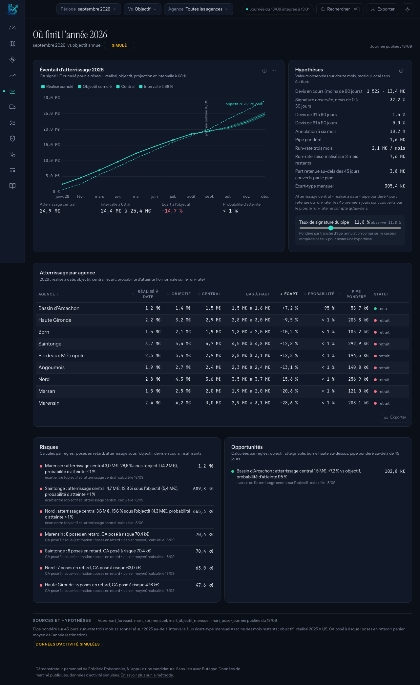

La question : où on atterrit, avec quelles hypothèses, quels risques, quelles opportunités.

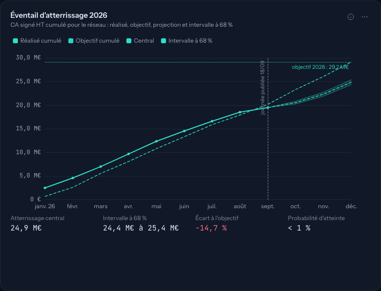

**Éventail d'atterrissage.**
- Ce que ça montre : le CA cumulé depuis janvier (ambre), l'objectif cumulé (pointillé vert), la ligne de la journée publiée, puis la projection jusqu'à décembre avec son intervalle à 68 %.
- Comment le lire : tant que la courbe ambre est au-dessus du pointillé, on est en avance ; à partir de l'été elle passe dessous et la projection finit à 24,8 M€ contre 29,2 M€ d'objectif : -15 %, probabilité d'atteinte inférieure à 1 %.
- Ce qu'on en fait : chiffrer ce qu'il manque et sur combien de mois.

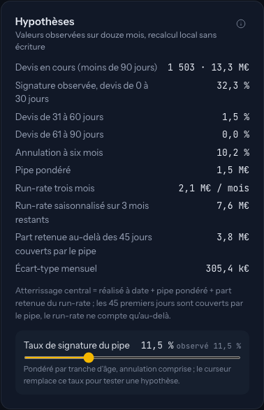

**Hypothèses.**
- Ce que ça montre : tout ce qui entre dans le calcul : les devis en cours de moins de 90 jours et leur montant, le taux de signature observé selon l'âge du devis, l'annulation à six mois, le pipe pondéré, le run-rate des trois derniers mois, sa projection saisonnalisée sur les mois restants et la part retenue au-delà des 45 jours déjà couverts par le pipe, l'écart-type mensuel.
- Comment le lire : réalisé à date + pipe pondéré + part retenue = atterrissage central (19,5 + 1,5 + 3,8 = 24,8 M€), on peut le refaire de tête. Le curseur « taux de signature du pipe » recalcule l'atterrissage à l'écran sans rien écrire : « et si le pipe signait à 20 % ? ».
- Ce qu'on en fait : discuter des hypothèses plutôt que du chiffre.

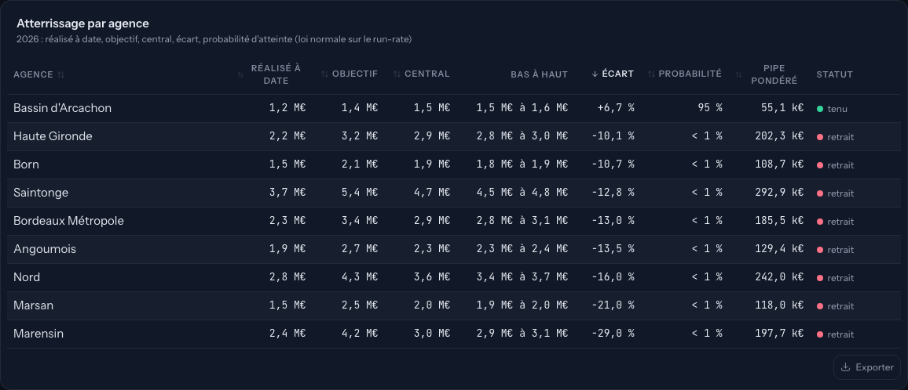

**Atterrissage par agence.**
- Ce que ça montre : réalisé à date, objectif, atterrissage central, fourchette, écart, probabilité d'atteinte, pipe pondéré, statut.
- Comment le lire : une seule agence est « tenu » (Bassin d'Arcachon, +6,7 %, probabilité 95 %) ; les autres sont en retrait de 10 à 29 %.

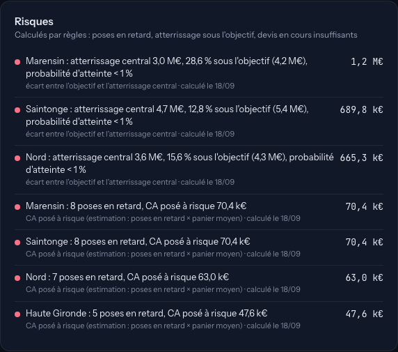
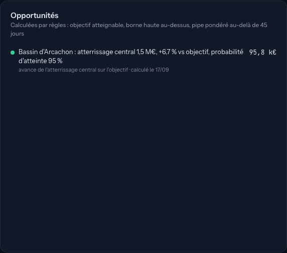

**Risques et opportunités.**
- Ce que ça montre : des signaux calculés par règles, chacun avec un montant et la nature de ce montant : poses en retard (CA posé à risque, estimé), atterrissage sous l'objectif (au plus trois lignes), devis en cours insuffisants pour couvrir un mois de run-rate ; en face, les agences dont l'objectif est atteignable, celles dont la borne haute dépasse l'objectif, celles dont le pipe couvre plus de 45 jours.
- Ce qu'on en fait : l'ordre du jour de la revue de forecast.

### 5.5 Pose et encaissement : « Ce qui est signé et pas encore posé »

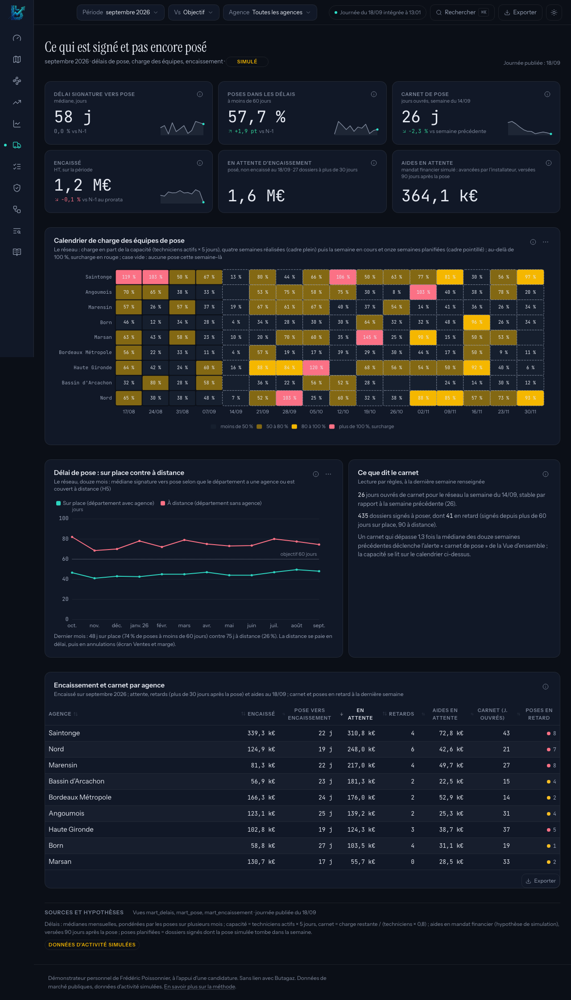

La question : quel délai entre signature et pose, quelle charge pour les équipes, ce qui reste à encaisser.

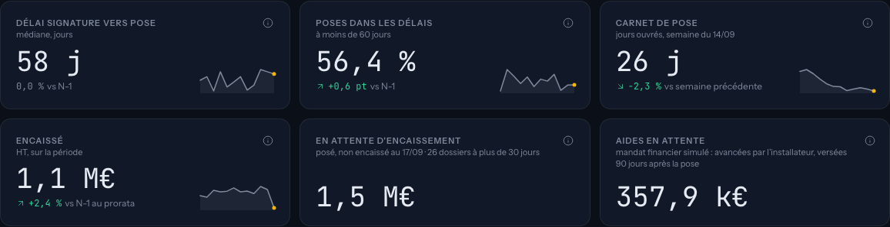

**Les six compteurs** : délai signature vers pose (médiane), poses dans les délais (moins de 60 jours), carnet de pose (jours ouvrés), encaissé, en attente d'encaissement, aides en attente.

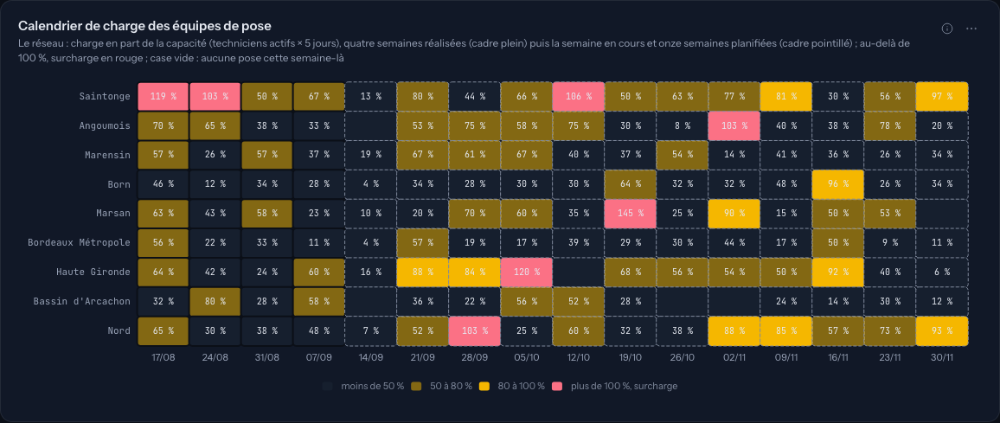

**Calendrier de charge des équipes de pose.**
- Ce que ça montre : une case par agence et par semaine, colorée par la charge en part de la capacité (techniciens actifs × 5 jours) : quatre semaines réalisées (cadre plein), puis la semaine en cours et onze semaines planifiées (cadre pointillé).
- Comment le lire : gris sous 50 %, ambre foncé de 50 à 80 %, ambre de 80 à 100 %, rouge au-delà de 100 % (surcharge : plus de poses planifiées que de capacité). Une case vide est une semaine sans pose.
- Ce qu'on en fait : déplacer des poses ou de la capacité avant que la semaine rouge n'arrive.

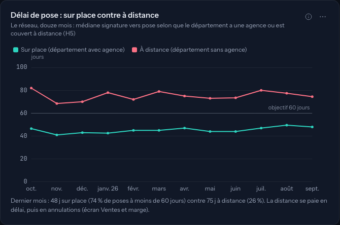

**Délai de pose, sur place contre à distance.**
- Ce que ça montre : douze mois de délai médian entre signature et pose, pour les dossiers des départements avec agence (sur place) et pour ceux couverts à distance.
- Comment le lire : la distance coûte environ un mois de délai (48 jours contre 74 au dernier mois), puis des annulations (écran Ventes).

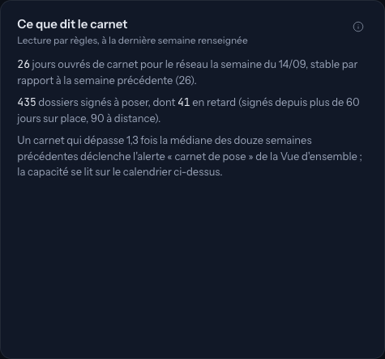

**Ce que dit le carnet.**
- Ce que ça montre : le carnet en jours ouvrés à la dernière semaine, sa tendance, les dossiers signés à poser et ceux en retard (plus de 60 jours sur place, 90 à distance), et la règle de l'alerte carnet.

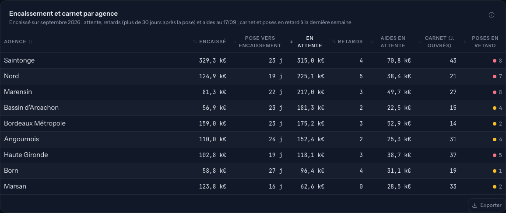

**Encaissement et carnet par agence.**
- Ce que ça montre : par agence, l'encaissé de la période, le délai pose vers encaissement, l'attente d'encaissement, les retards (plus de 30 jours après la pose), les aides en attente, le carnet et les poses en retard.
- Ce qu'on en fait : la trésorerie et la charge technique dans un seul tableau.

### 5.6 Plans d'action et rituels : « Ce qu'on a décidé de changer »

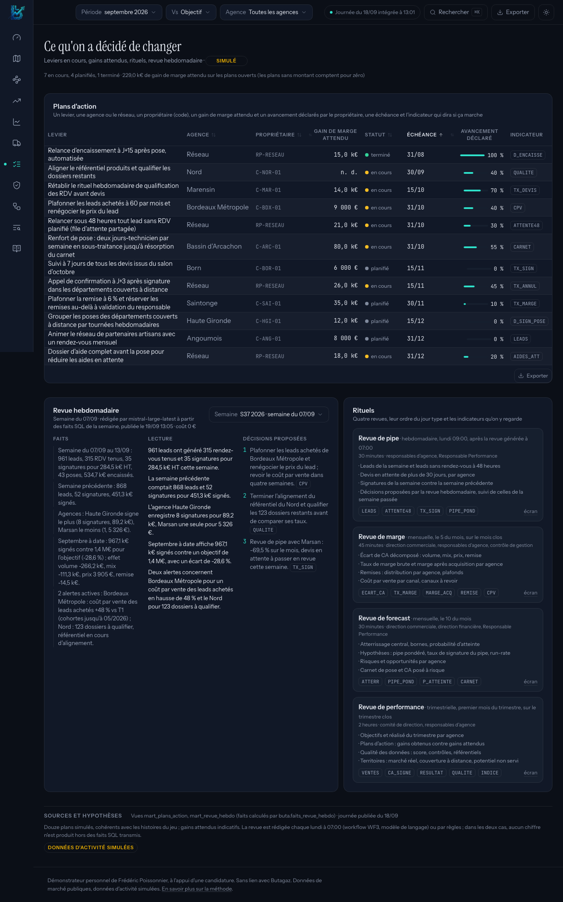

La question : quels leviers sont engagés, par qui, pour quel gain, et comment on en parle chaque semaine.

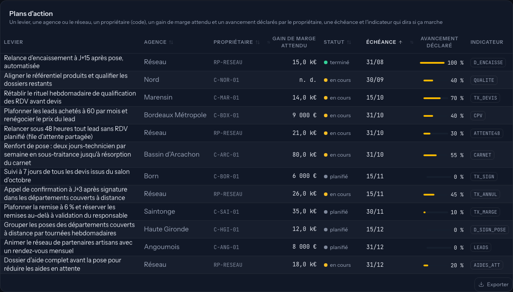

**Plans d'action.**
- Ce que ça montre : douze plans, chacun avec un levier, une agence ou le réseau, un propriétaire (code), un gain de marge attendu et un avancement déclarés par le propriétaire, un statut, une échéance et l'indicateur qui dira si ça marche.
- Comment le lire : les plans découlent des histoires plantées dans la simulation : plafonner les leads achetés de Bordeaux Métropole, plafonner la remise en Saintonge, renforcer la pose au Bassin d'Arcachon, aligner le référentiel du Nord. « n. d. » dans la colonne des gains signale un levier de qualité, non chiffrable en marge.
- Ce qu'on en fait : la liste que le Responsable Performance tient à jour et fait vivre dans les rituels.

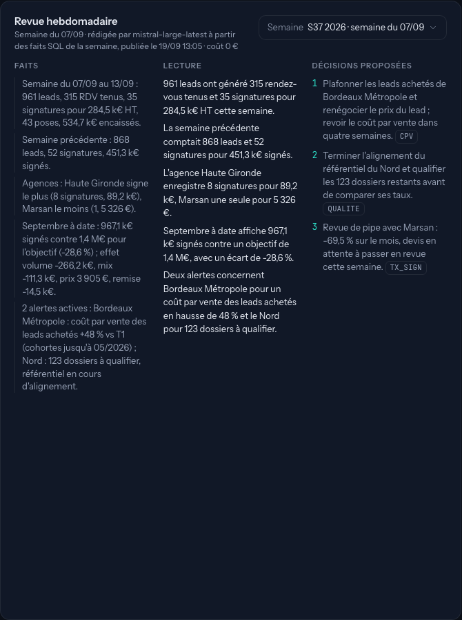

**Revue hebdomadaire.**
- Ce que ça montre : chaque semaine, trois colonnes : les **faits** (leads, RDV, signatures, CA, poses, encaissé, comparaison avec la semaine précédente, écarts du mois, alertes), la **lecture** (cinq phrases d'interprétation) et les **décisions proposées**, chacune rattachée à un indicateur.
- Comment le lire : les faits sont calculés en SQL ; la lecture est rédigée par règles, ou par un modèle de langage le lundi à 07:00 quand il est branché, avec un contrôle qui refuse tout nombre absent des faits ; le sous-titre dit qui a rédigé et quand. Le sélecteur en haut à droite ouvre les semaines précédentes.
- Ce qu'on en fait : la revue de pipe du lundi matin, prête avant l'arrivée au bureau.

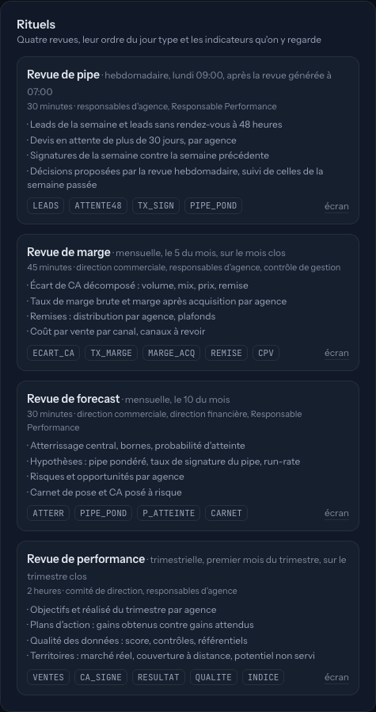

**Rituels.**
- Ce que ça montre : quatre revues avec leur cadence, leur moment, leur durée, leurs participants, leur ordre du jour type et les indicateurs qu'elles regardent : revue de pipe (hebdomadaire, lundi 09:00, 30 minutes), revue de marge (le 5 du mois, 45 minutes), revue de forecast (le 10 du mois, 30 minutes), revue de performance (trimestrielle, comité de direction, 2 heures).
- Ce qu'on en fait : c'est le mode de fonctionnement proposé pour le poste, écran par écran.

### 5.7 Qualité et référentiels : « Peut-on faire confiance au chiffre »

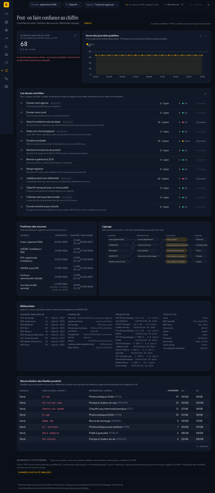

La question : la confiance dans le chiffre, rendue visible.

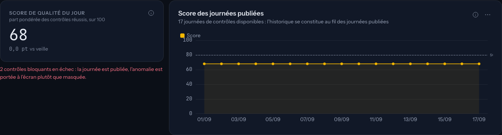
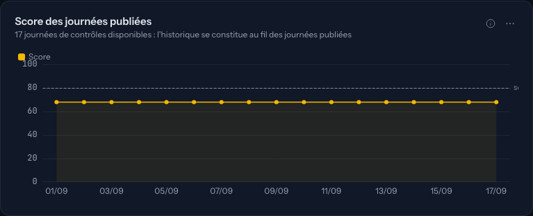

**Score de qualité du jour et courbe des journées publiées.**
- Ce que ça montre : un score de 0 à 100, part pondérée des contrôles réussis (poids 3 pour un contrôle bloquant), et son historique sur les journées publiées.
- Comment le lire : 68 le 17 septembre, parce que deux contrôles bloquants sont en échec ; l'écran le dit au lieu de le masquer.

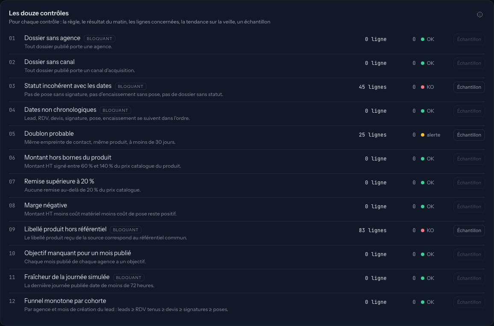

**Les douze contrôles.**
- Ce que ça montre : pour chaque contrôle, la règle en une phrase, le nombre de lignes en défaut, la tendance sur la veille, le statut (OK, alerte, KO) et un échantillon des lignes concernées.
- Comment le lire : les contrôles marqués « bloquant » comptent triple ; le 17 septembre, « statut incohérent avec les dates » (45 lignes) et « libellé produit hors référentiel » (83 lignes) sont KO, « doublon probable » (25 lignes) est en alerte. Ce sont les traces de l'agence intégrée en juin.
- Ce qu'on en fait : traiter l'anomalie de données avant de lire un chiffre.

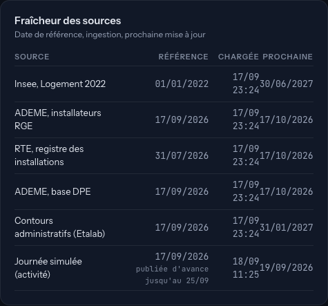

**Fraîcheur des sources.**
- Ce que ça montre : pour chaque source (journée simulée, Insee, RGE, RTE, DPE, contours), la date de référence, la date de chargement et la prochaine mise à jour attendue ; pour la journée simulée, jusqu'à quelle date les dossiers sont déjà publiés d'avance.

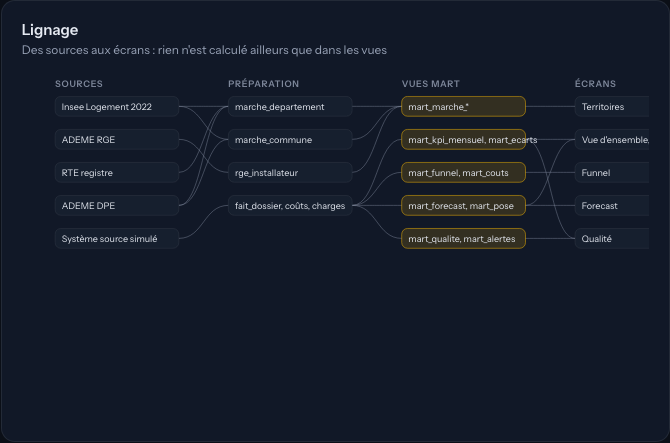

**Lignage.**
- Ce que ça montre : le chemin des sources aux écrans : sources, tables de préparation, vues de calcul, écrans. Rien n'est calculé ailleurs que dans les vues.

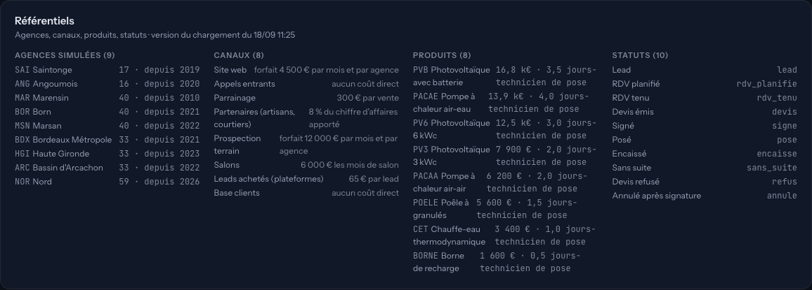

**Référentiels.**
- Ce que ça montre : les agences (code, bassin, département, année d'ouverture), les canaux avec leur modèle de coût, les produits avec prix catalogue et durée de pose en jours-technicien, les statuts. Ce sont les listes de référence que toutes les entités doivent partager.

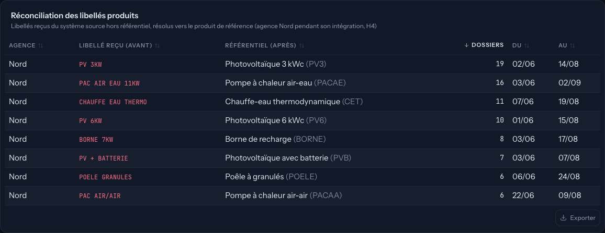

**Réconciliation des libellés produits.**
- Ce que ça montre : les libellés reçus du système source de l'agence Nord pendant son intégration (« PAC AIR EAU 11KW », « PV 3KW ») et le produit du référentiel vers lequel chacun a été résolu, avec le nombre de dossiers et la période.
- Ce qu'on en fait : c'est exactement le travail d'alignement des référentiels après un rachat, rendu visible.

### 5.8 Territoires : « Où est le potentiel non servi »

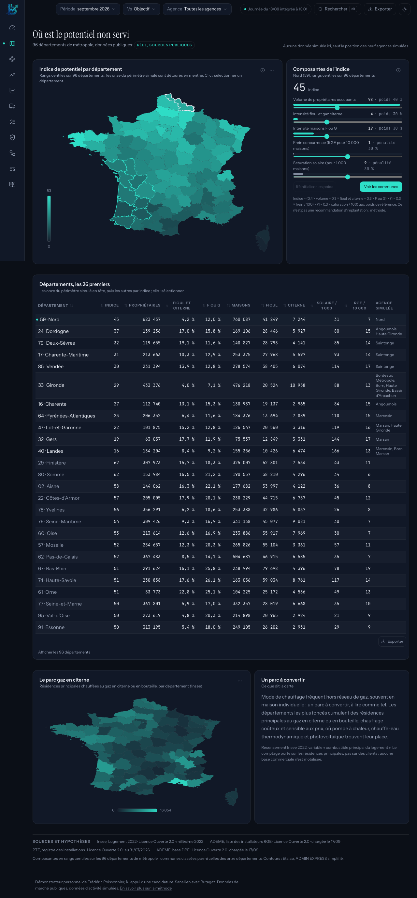

La question : que dit le marché réel des territoires couverts et alentour. Rien n'est simulé sur cet écran, sauf la position des neuf agences.

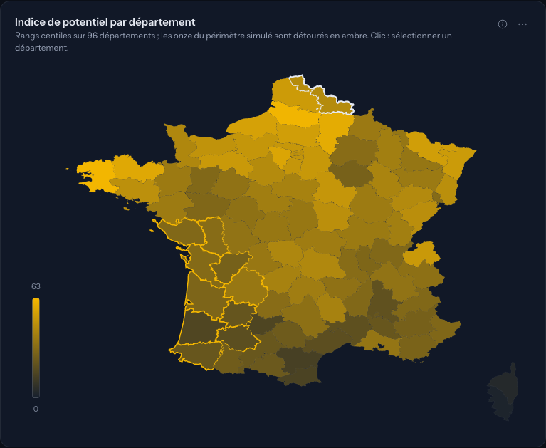

**Indice de potentiel par département.**
- Ce que ça montre : la France des 96 départements colorée par un indice de 0 à 100 ; les onze départements du périmètre simulé sont détourés en ambre.
- Comment le lire : plus le département est clair, plus le potentiel non servi est élevé ; le survol donne les chiffres bruts (propriétaires occupants, résidences au fioul et au gaz citerne, maisons F ou G, installations solaires, installateurs RGE). Un clic sélectionne le département.
- Ce qu'on en fait : une lecture du marché, explicitement pas une recommandation d'implantation.

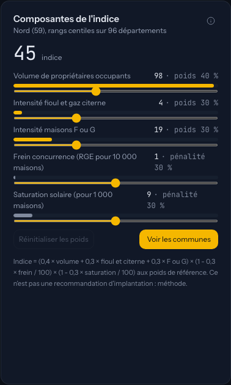

**Composantes de l'indice.**
- Ce que ça montre : pour le département sélectionné, les cinq composantes en rangs centiles (le Nord : volume de propriétaires 98, intensité fioul et citerne 4, maisons F ou G 19, frein concurrence RGE 1, saturation solaire 9) et leurs poids, réglables au curseur.
- Comment le lire : indice = (0,4 × volume + 0,3 × fioul et citerne + 0,3 × F ou G) × (1 - 0,3 × frein / 100) × (1 - 0,3 × saturation / 100). Déplacer un curseur recalcule la carte et le tableau à l'écran ; « Réinitialiser les poids » revient aux poids de référence.
- Ce qu'on en fait : discuter des poids en réunion, pas d'un chiffre sorti d'une boîte noire.

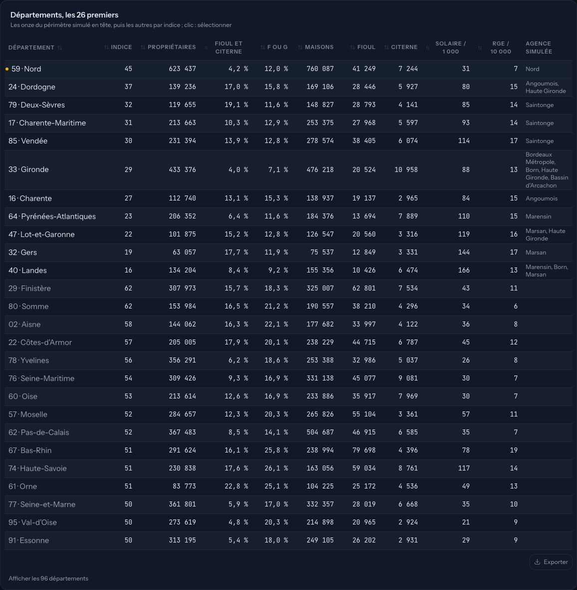

**Départements.**
- Ce que ça montre : les onze du périmètre en tête, puis les autres par indice ; les chiffres bruts en colonnes, exportables ; « Afficher les 96 départements » pour tout voir ; « Voir les communes » ouvre la vue communale du département sélectionné (potentiel par commune, agence du bassin, installateurs RGE en points sans nom).

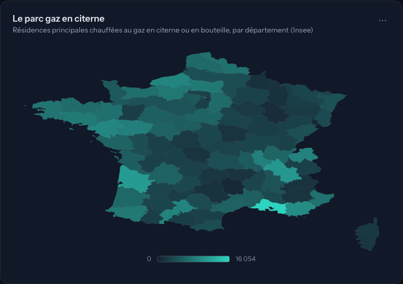
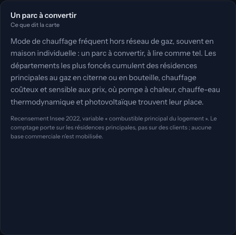

**Le parc gaz en citerne et « un parc à convertir ».**
- Ce que ça montre : les résidences chauffées au gaz en citerne ou en bouteille par département (Insee 2022), et ce que ce parc représente dans le périmètre.
- Comment le lire : un parc à convertir, à lire comme tel : ce sont des ménages équipés d'une énergie que le métier remplace.

### 5.9 Automatisations : « Ce qui tourne chaque matin »

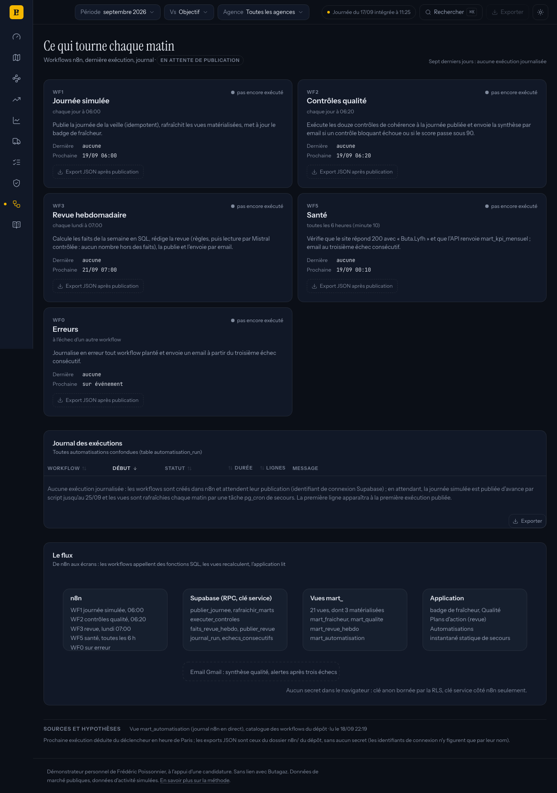

La question : qu'est-ce qui se fait sans personne, quand, et est-ce que ça a marché.

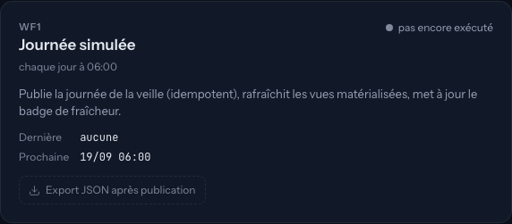

**Les cinq cartes de workflows** (Journée simulée, Contrôles qualité, Revue hebdomadaire, Santé, Erreurs).
- Ce que ça montre : pour chaque automatisation, son déclencheur (chaque jour à 06:00, à 06:20, le lundi à 07:00, toutes les six heures, sur erreur), ce qu'elle fait, sa dernière et sa prochaine exécution, son statut, et le bouton d'export de sa définition (un fichier sans aucun secret).
- Comment le lire : « pas encore exécuté » et « Export JSON après publication » signifient que le workflow est construit mais pas encore publié dans l'outil d'automatisation (il attend un identifiant de connexion) ; en attendant, la journée simulée est publiée d'avance par script et les vues sont rafraîchies chaque matin par une tâche de secours dans la base.

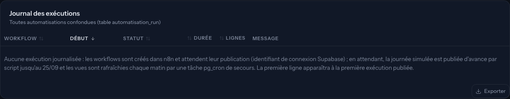

**Journal des exécutions.**
- Ce que ça montre : les cinquante dernières exécutions, tous workflows confondus : début, statut, durée, lignes traitées, message. L'état vide explique pourquoi il est vide.

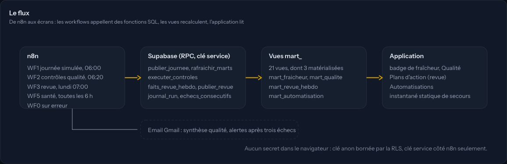

**Le flux.**
- Ce que ça montre : de l'outil d'automatisation aux écrans : les workflows appellent des fonctions SQL avec une clé serveur, les vues recalculent, l'application lit ; les alertes partent par email ; aucun secret ne circule dans le navigateur.

### 5.10 Analyste : « Posez la question au cockpit »

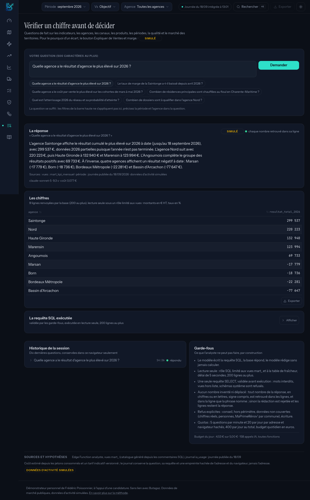

La question : que répond le cockpit quand on lui pose une question en français, et peut-on lui faire confiance. L'écran est entré dans la navigation le 19 septembre 2026, après un jeu d'évaluation de vingt-quatre questions réussi à 100 % (le seuil de mise en ligne était de 90 %).

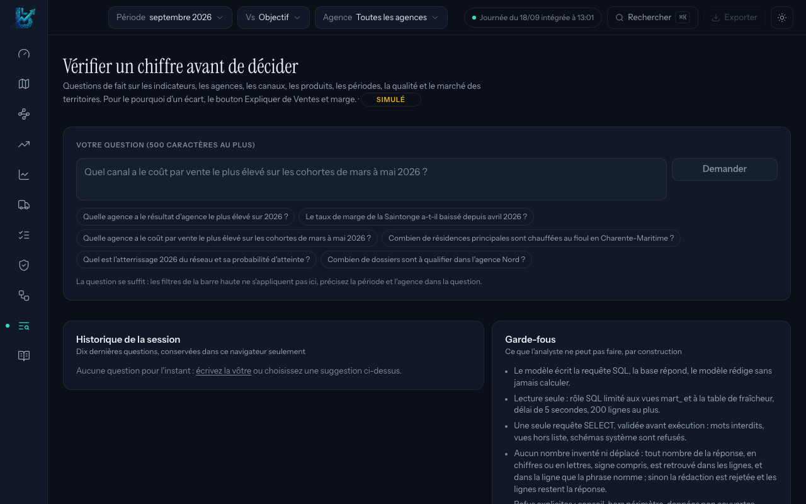

**Le formulaire et les suggestions.**
- Ce que ça montre : un champ de question libre (500 caractères au plus), le bouton « Demander », six suggestions qui correspondent aux histoires plantées dans la simulation et au marché réel. En haut à droite, le coût du jour et le nombre d'appels, avec le budget quotidien dès qu'une réponse l'a transmis.
- Comment le lire : une question porte sur les indicateurs, les agences, les canaux, les produits, les périodes, les délais, la qualité ou le marché des territoires. Le modèle écrit une requête SQL en lecture seule sur les vues autorisées, la base l'exécute sous un rôle limité (cinq secondes, deux cents lignes), puis le modèle rédige à partir des lignes renvoyées, sans jamais calculer.

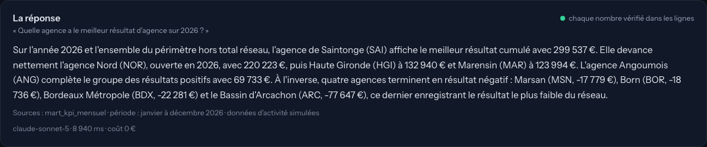

**La réponse.**
- Ce que ça montre : trois à six phrases en français, la période et le périmètre rappelés, les codes traduits en bassins, puis les sources (vues utilisées, période, « données d'activité simulées » ou « marché réel »), le modèle, la durée et le coût de la question.
- Comment le lire : la pastille verte « chaque nombre vérifié dans les lignes » dit que tous les nombres de la prose ont été retrouvés dans les lignes renvoyées par la base. Si un nombre ne s'y trouve pas, la rédaction est rejetée, la pastille passe en orange et une phrase explique que les lignes ci-dessous restent la réponse.

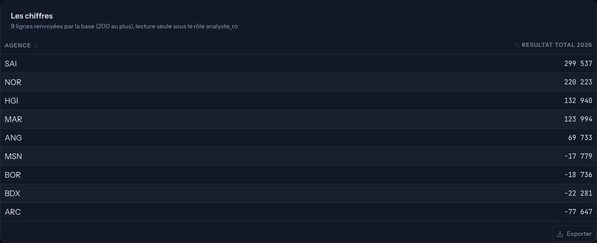

**Les chiffres.**
- Ce que ça montre : les lignes exactes renvoyées par la base, avec les noms de colonnes choisis par le modèle, triables et exportables comme tout tableau du site.
- Comment le lire : c'est la matière première de la réponse ; en cas de doute sur une phrase, la ligne fait foi.

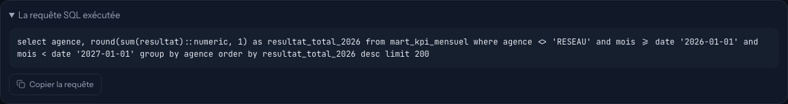

**La requête SQL exécutée.**
- Ce que ça montre : la requête telle qu'elle a été validée et exécutée, dépliable et copiable.
- Comment le lire : un lecteur qui connaît SQL vérifie en quelques secondes le périmètre (agence, mois, canal), les filtres et le calcul ; c'est la transparence qui rend la réponse discutable en réunion.

**Une question refusée.**
- Ce que ça montre : le motif du refus, en clair. Quatre motifs existent : conseil (« faut-il ouvrir une agence à Niort ? » : le démonstrateur lit le marché, il ne recommande pas), hors périmètre (la météo), données non couvertes (chiffres réels d'une entreprise, résultats par personne, MaPrimeRénov' par commune), écriture (toute demande de modification ou de suppression).
- Comment le lire : un refus n'est pas une panne. Le refus a coûté un seul appel court au modèle.

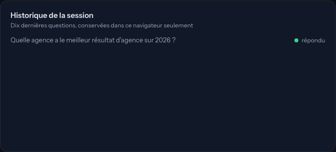

**Historique de la session.**
- Ce que ça montre : les dix dernières questions posées dans ce navigateur, avec leur statut (répondu, refusé) ; un clic rouvre la réponse. Rien n'est conservé ailleurs que dans le navigateur.

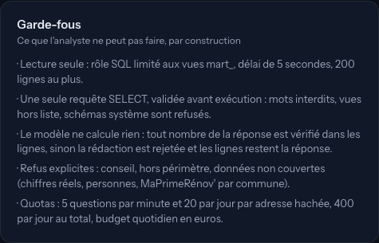

**Garde-fous.**
- Ce que ça montre : ce que l'analyste ne peut pas faire, par construction : lecture seule sur les vues, une seule requête SELECT validée avant exécution (mots interdits, vues hors liste, schémas système refusés), contrôle des nombres, refus explicites, quotas (cinq questions par minute et vingt par jour par adresse hachée, quatre cents par jour au total) et budget quotidien en euros.

### 5.11 Méthode et auteur

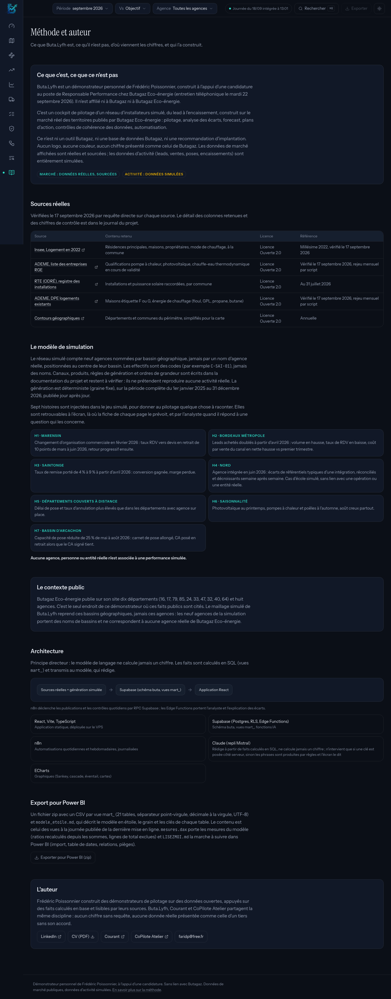

La page qui dit tout : ce que c'est et ce que ce n'est pas, les sources réelles avec liens et licences, le modèle de simulation et les sept histoires, le contexte public cité une seule fois (dix départements et huit agences publiés par l'entreprise, rachat de Lumélio annoncé en mai 2026), l'architecture en langage simple, l'export Power BI (vingt et une tables CSV, un modèle en étoile documenté, quarante mesures DAX et un mode d'emploi), l'auteur et ses liens.

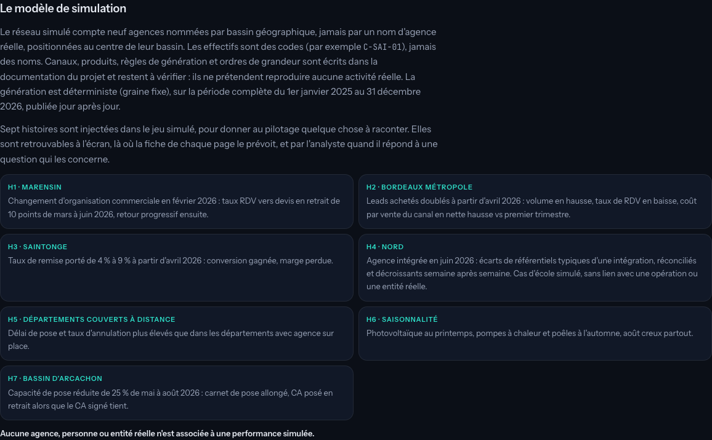

---

## 6. Les sept histoires plantées dans la simulation, et où les retrouver

Une simulation n'est utile que si l'on peut y retrouver des situations connues. Sept histoires ont été plantées ; aucune ne décrit un fait réel.

| Histoire | Ce qui se passe | Où ça se voit |
|---|---|---|
| H1 Marensin | Changement d'organisation commerciale en février 2026 : taux RDV vers devis en retrait de 10 points de mars à juin, retour progressif ensuite | Funnel (taux de devis par agence), Forecast (Marensin à -29 %) |
| H2 Bordeaux Métropole | Leads achetés doublés à partir d'avril 2026 : volume en hausse, taux de RDV du canal en baisse, coût par vente du canal +48 % vs premier trimestre | Alerte de l'accueil, Funnel (qualité des leads par canal, leads par canal) |
| H3 Saintonge | Taux de remise porté de 4 % à 9 % à partir d'avril 2026 : conversion gagnée, marge perdue | Ventes et marge (remises, tableau des agences) |
| H4 Nord | Agence intégrée en juin 2026 : dossiers sans statut, doublons, libellés produits divergents, réconciliés semaine après semaine ; cas d'école simulé, sans lien avec une opération réelle | Qualité (contrôles 3, 5, 9 ; réconciliation des libellés), alerte de l'accueil |
| H5 Départements à distance | Délai de pose et annulations plus élevés que sur place (74 jours contre 48, 14 % contre 8 %) | Pose (délai sur place contre à distance), Ventes (annulations) |
| H6 Saisonnalité | Photovoltaïque au printemps, chauffage à l'automne, août creux partout | Ventes (CA par produit), Funnel (leads par canal) |
| H7 Bassin d'Arcachon | Capacité de pose réduite de 25 % de mai à août 2026 : carnet allongé, CA posé en retrait alors que le CA signé tient | Pose (calendrier, carnet), Plans d'action (renfort de pose) |

Vingt tests SQL vérifient chaque matin que ces histoires se retrouvent bien dans les vues.

---

## 7. Notice d'utilisation

### 7.1 Prise en main en dix minutes

1. Ouvrir https://buta.lyfh.fr. Sur ordinateur, le rail à gauche liste les écrans ; sur téléphone, le bouton en haut à gauche ouvre le tiroir.
2. Regarder le badge de fraîcheur en haut : « Journée du 17/09 intégrée à 11:25 » dit jusqu'où les données vont.
3. Lire les quatre compteurs de l'accueil, puis l'atterrissage, puis les alertes du matin.
4. Cliquer sur le « i » d'un compteur : la fiche dit ce que le chiffre veut dire et d'où il vient.
5. Changer la période (mois, trimestre, année à date) et la comparaison (objectif, N-1) dans la barre haute : tous les écarts se recalculent.
6. Choisir une agence : chaque écran se recentre sur elle, son nom passe dans le titre.
7. Aller sur Ventes et marge pour comprendre un écart, sur Funnel pour une conversion, sur Forecast pour l'année, sur Pose pour la charge technique, sur Qualité avant de croire un chiffre qui surprend.
8. Exporter un tableau (bouton en bas à droite) ou tout l'écran (bouton Exporter de la barre haute).
9. Copier l'adresse de la page pour partager exactement la même vue.
10. Sur la page Méthode, télécharger l'export Power BI si l'on veut travailler dans son propre outil.

### 7.2 Les parcours types

**Le matin, cinq minutes.** Badge de fraîcheur ; accueil (compteurs, atterrissage, alertes) ; Qualité (score et contrôles en échec) ; « Ce que dit le mois » pour le point quotidien. Une question à l'Analyste quand un chiffre surprend (« quelles agences sont sous leur objectif en septembre ? »).

**Chaque semaine.** Plans d'action : la revue hebdomadaire du lundi (faits, lecture, décisions). Funnel : où se perd la conversion, les leads sans rendez-vous à 48 h, le canal « à revoir ». Forecast : le pipe pondéré, les devis qui vieillissent, les risques.

**Chaque mois.** Ventes et marge : la cascade de l'écart, les agences qui gagnent ou perdent de l'argent, la distribution des remises. Forecast : atterrissage, hypothèses, curseur pour tester un scénario. Pose : calendrier de charge et carnet.

**Chaque trimestre.** Territoires : le marché réel, l'indice avec les poids discutés en réunion, la couverture des départements à distance et ce qu'elle coûte. Export Power BI pour les directions.

### 7.3 Les gestes utiles

| Geste | Où | Effet |
|---|---|---|
| Cmd K ou Ctrl K | partout | palette : aller à un écran, filtrer une agence, ouvrir une fiche |
| Clic sur un en-tête de colonne | tableaux | tri croissant, puis décroissant |
| Menu « ⋯ » d'un graphique | graphiques | plein écran, image PNG, export CSV, requête SQL |
| Bouton « i » | compteurs, graphiques, tableaux | fiche de l'indicateur (Échap pour fermer) |
| Curseur « taux de signature du pipe » | Forecast | recalcule l'atterrissage sans rien écrire |
| Curseurs de poids | Territoires | recalcule l'indice, la carte et le tableau |
| Sélecteur de canal | Funnel | filtre le diagramme de flux |
| Sélecteur de semaine | Plans d'action | ouvre une revue précédente |
| Bouton « Expliquer » | Ventes, accueil | explication rédigée sur les mêmes faits (par règles si le modèle n'est pas branché) |
| Question en français | Analyste | requête SQL écrite par le modèle, lignes exactes, réponse dont chaque nombre est vérifié |
| Bouton rond en haut à droite | partout | thème sombre ou clair |
| Adresse de la page | partout | contient période, comparaison et agence ; se partage telle quelle |

### 7.4 Ce qu'il faut savoir pour ne pas se tromper

- **Le mois en cours est proratisé.** « -27,8 % vs objectif prorata » compare 17 jours de réalisé à 17/30 de l'objectif. Sans cela, tout mois en cours serait faussement en retard.
- **Une cohorte de moins de 90 jours n'a pas fini de convertir.** Ses taux sont provisoires et grisés ; les compteurs de conversion se lisent sur la dernière cohorte mûre, nommée sous le libellé.
- **« n. d. » n'est jamais un zéro.** C'est une valeur qu'on ne peut pas calculer honnêtement (pas d'historique 2024, signatures de moins de 60 jours, aucune vente dans le dénominateur).
- **Le résultat d'agence en cours de mois est souvent négatif** : les coûts d'acquisition sont engagés à la création du lead, la marge arrive à la signature. Sur un mois plein, le réseau est autour de l'équilibre avec des agences gagnantes et perdantes.
- **Les données d'activité sont simulées.** Elles sont cohérentes, calibrées sur le marché réel, mais elles ne décrivent l'activité de personne.
- **Le badge « instantané »** signifie que la base n'a pas répondu et que l'application montre les données embarquées avec le site ; les chiffres datent alors du dernier déploiement.
- **Les workflows d'automatisation affichent « pas encore exécuté »** tant qu'ils ne sont pas publiés ; les vues sont rafraîchies chaque matin par une tâche de secours et la journée simulée est publiée d'avance.

### 7.5 Sur téléphone

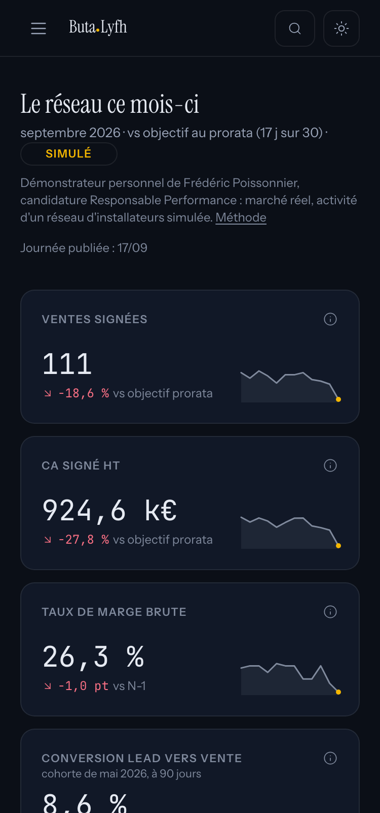

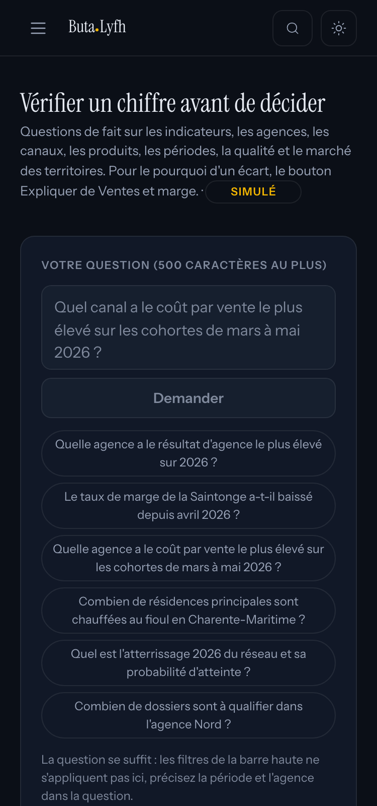

Tout se lit à 375 px sans zoom : les compteurs s'empilent, les tableaux gardent leurs colonnes essentielles et se font défiler horizontalement, les graphiques prennent une hauteur adaptée, le diagramme de flux se lit de haut en bas. Une ligne sous le titre rappelle l'objet du site.

---

## 8. Questions fréquentes

**Ce sont les données de l'entreprise ?** Non. Le marché est public et sourcé (Insee, ADEME, RTE, Etalab), l'activité est simulée par un générateur dont les hypothèses sont écrites. Rien de ce qui est affiché ne décrit l'activité de l'entreprise.

**Pourquoi simuler plutôt que prendre un jeu de données existant ?** Parce qu'un réseau d'installateurs n'a pas de jeu public, et parce qu'une simulation permet de planter des situations à retrouver (une agence qui remise trop, un canal qui dérape, une intégration) et de vérifier que les indicateurs les font remonter.

**Comment être sûr des chiffres ?** Aucun calcul dans l'interface : tout est en SQL ou dans une bibliothèque testée ; chaque indicateur a sa fiche avec la formule ; le mois en cours est proratisé ; les cohortes immatures ne sont pas comparées ; douze contrôles tournent chaque matin ; vingt tests SQL vérifient les vues et les histoires ; une relecture à trois lentilles (faits, forme, recruteur simulé) a été faite avant la mise en ligne.

**Et avec des données réelles ?** Le modèle (un dossier avec ses dates, son agence, son canal, son produit, ses montants) est celui d'un CRM d'installateur. L'ingestion remplacerait le générateur ; les vues, les contrôles, les référentiels et les écrans resteraient.

**Que fait le modèle de langage ?** Il rédige à partir de faits calculés en SQL et ne calcule jamais ; un contrôle refuse toute phrase contenant un nombre absent des faits. Sans clé configurée, tout est rédigé par règles et l'écran le dit.

**L'analyste peut-il se tromper ?** Il peut mal choisir une vue ou un filtre, comme un analyste humain pressé : c'est pourquoi la requête et les lignes sont toujours affichées avec la réponse. Ce qu'il ne peut pas faire, c'est inventer un chiffre : tout nombre de sa phrase absent des lignes fait rejeter la phrase. Le jeu d'évaluation de vingt-quatre questions (dont quatre refus attendus) est rejoué avant chaque mise en ligne de l'écran.

**Et Power BI ?** L'export de la page Méthode fournit les tables en CSV, un modèle en étoile documenté (grain, clés, mesures à recalculer depuis les sommes, jamais des moyennes de taux), quarante mesures DAX et un mode d'emploi.

**Combien ça coûte à faire tourner ?** Un hébergement mutualisé, une base Supabase, une instance d'automatisation : quelques dizaines d'euros par mois, et un budget de modèle de langage plafonné par jour.

---

## 9. Annexes

### 9.1 Formules essentielles

- Ventes signées : dossiers signés dans le mois, hors annulations connues à la journée publiée.
- CA signé HT : somme des montants HT nets de remise ; CA posé et encaissé : idem au mois de pose et d'encaissement.
- Taux de marge brute : (CA - matériel - pose) / CA. Marge après acquisition : marge brute - coûts d'acquisition - commissions. Résultat d'agence : marge après acquisition - charges d'agence.
- Panier moyen : CA signé / ventes. Remise moyenne : remises / prix catalogue, pondérée par les prix.
- Taux d'annulation à 60 jours : annulations dans les 60 jours de la signature / signatures.
- Taux de RDV : RDV tenus / leads ; taux de devis : devis / RDV tenus ; taux de signature : signatures / devis ; conversion : ventes nettes / leads, sur une cohorte mûre.
- Coût par lead : coûts du canal / leads ; coût par vente : coûts du canal / ventes de la cohorte, hors commissions.
- Écart de CA : volume + mix + prix + remise, résiduel nul par construction (effet remise mesuré dossier par dossier contre le taux de la comparaison).
- Atterrissage : réalisé + pipe pondéré + projection × (mois restants - 1,5) / mois restants ; intervalle à un écart-type mensuel × racine des mois restants ; probabilité d'atteinte par loi normale.
- Carnet de pose : signatures non posées × durée de pose du produit / capacité hebdomadaire des techniciens, en jours ouvrés.
- Indice de potentiel : (0,4 × volume + 0,3 × fioul et citerne + 0,3 × F ou G) × (1 - 0,3 × frein RGE / 100) × (1 - 0,3 × saturation solaire / 100), composantes en rangs centiles sur 96 départements.
- Score de qualité : 100 × poids des contrôles OK / poids total (3 pour un contrôle bloquant, 1 sinon).

### 9.2 Les captures

Toutes les captures de ce guide sont dans `docs/captures/guide/` : une page entière par écran, une image par carte, les éléments communs (barre haute, fiche, palette, export, thème clair) et quatre vues téléphone. Celles de l'écran Analyste ont été prises le 19 septembre 2026 après sa mise en navigation, journée publiée du 18 septembre. Elles ont été prises sur le site en ligne le 18 septembre 2026 au soir, journée publiée du 17 septembre.

### 9.3 Pour aller plus loin

Le dépôt contient la documentation complète : le brief, les écrans composant par composant, le catalogue des indicateurs, les données et le modèle de simulation, le système de design, l'architecture, le déploiement, les automatisations, l'analyste, le backlog, la vérification et le journal des décisions.
